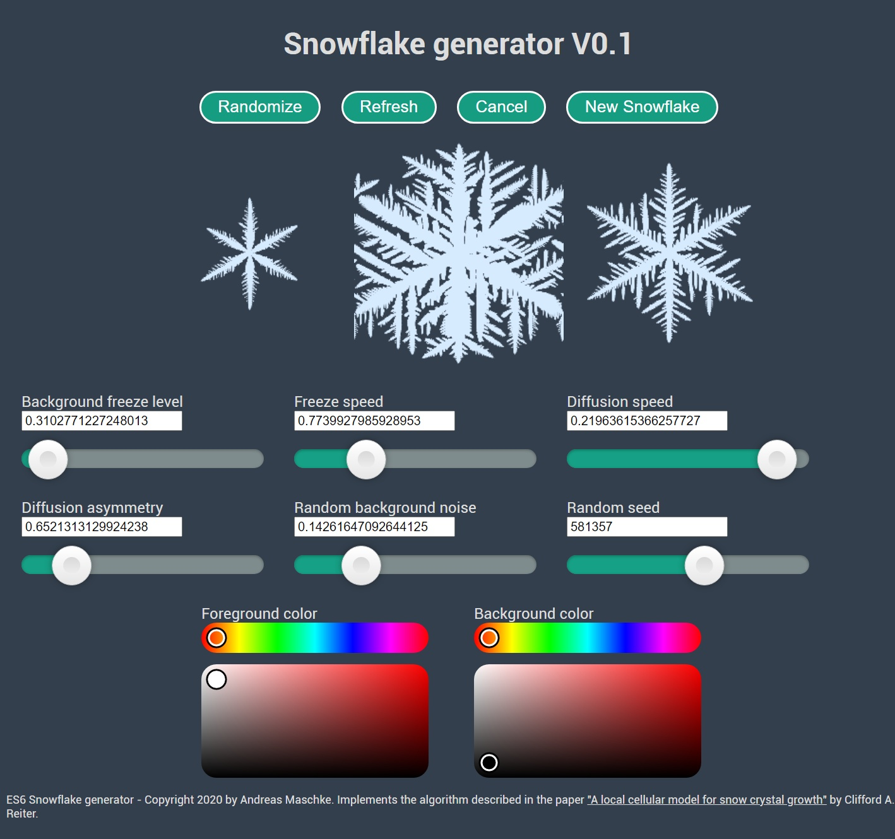

#ES6 Snowflake generator
A relaxing Snowflake generator written in ES6, HTML5 and CSS3. 
Should work well on any modern browser, runs pure locally, so does not need a server.

Implements the algorithm described in the paper "A local cellular model for snow crystal growth" by Clifford A. Reiter.

Images may be rendered with transparent background to be used in other software.

#Live version: https://snowflake.overwhale.com

#References
##Link to the original paper:
http://patarnott.com/pdf/SnowCrystalGrowth.pdf

Thanks Entagma (https://entagma.com) for the pointer to the paper!

##Dependencies:
Uses the following external components
Range-Slider: https://github.com/Stryzhevskyi/rangeSlider (minified)
Iro Color Picker: https://iro.js.org/ (minified)
Mersenne-Twister RNG: https://gist.github.com/banksean/300494 (minified)
Traceur-Compiler: https://github.com/google/traceur-compiler (external link)